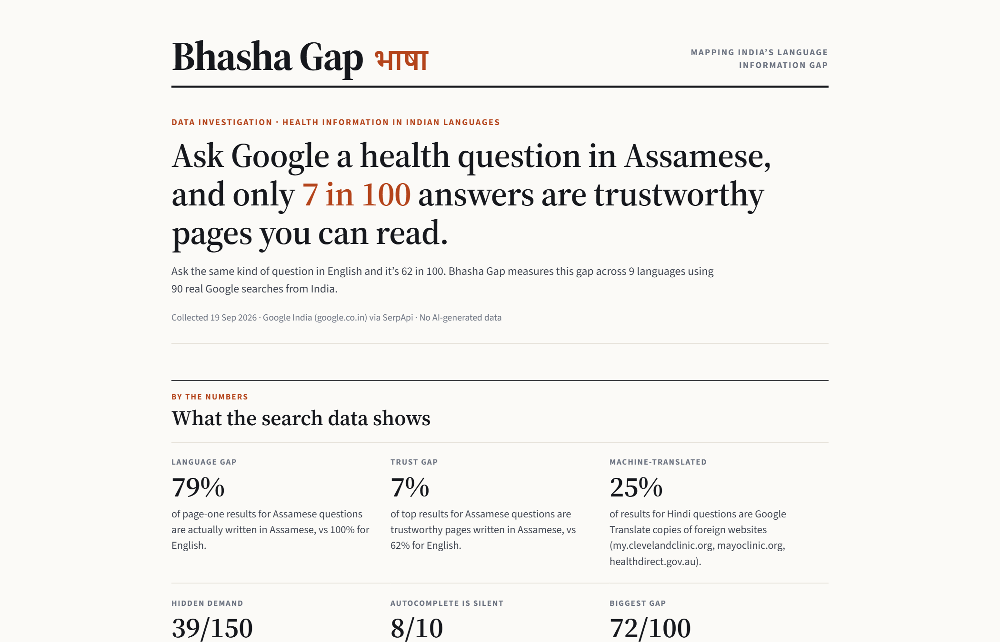
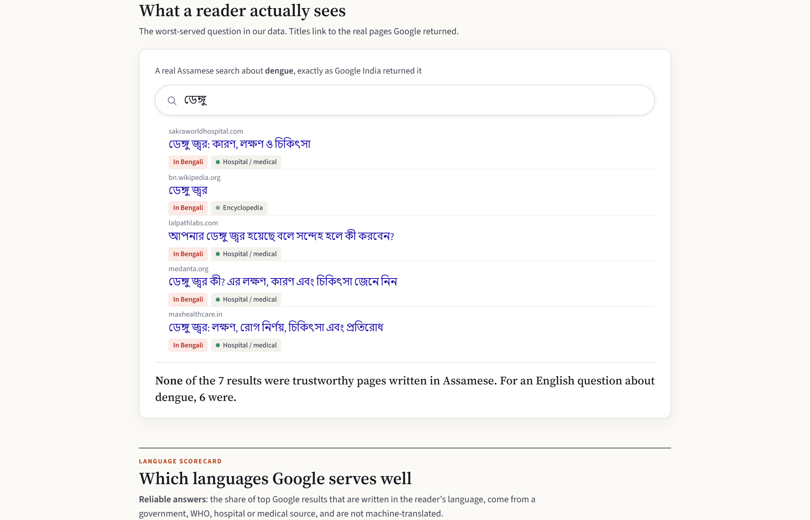
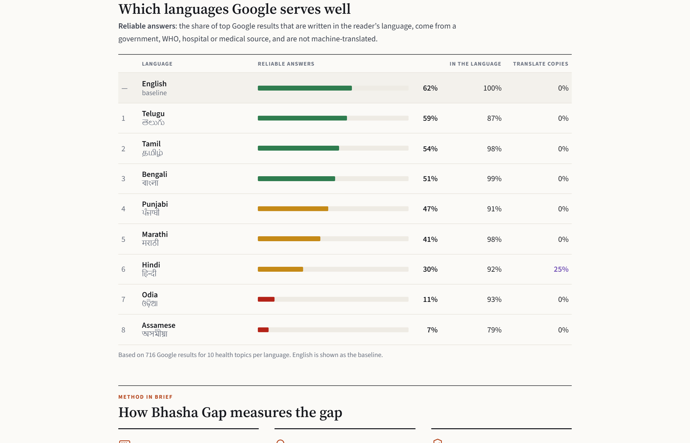
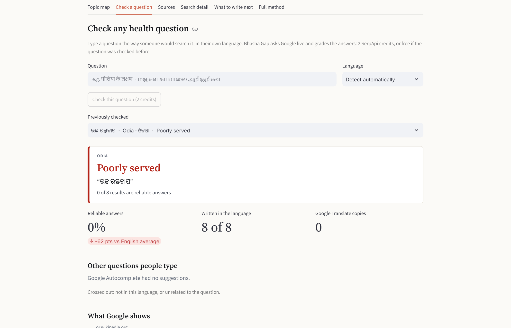
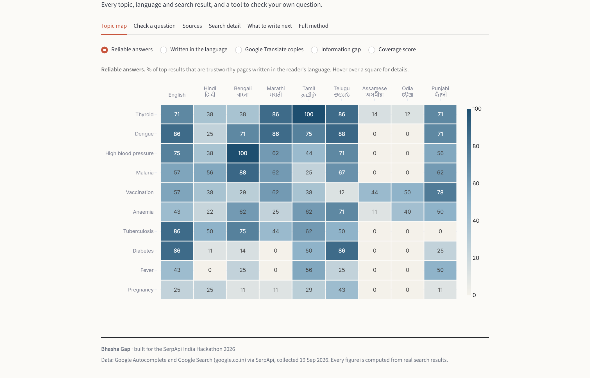

# Bhasha Gap · भाषा

**Mapping India's language information gap with search data.**

> Ask Google a health question in **Assamese**, and only **7 in 100** answers are trustworthy pages you can read.
> Ask in English, and it's **62 in 100**.

Hundreds of millions of Indians search for health information in their own language. Bhasha Gap measures how often Google actually answers them in that language, from a source they can trust. It covers 9 languages and 10 health topics, using 90 real Google searches from India.



**SerpApi India Hackathon 2026 · Track: Knowledge & Public Interest**

---

## What we found

Data collected from Google India (google.co.in) via SerpApi on 19 Sep 2026: 716 search results.

| | Finding |
|---|---|
| **7%** | of top results for Assamese health questions are trustworthy pages written in Assamese. English gets **62%**. |
| **25%** | of results for Hindi questions are **Google Translate copies** of foreign websites (Cleveland Clinic, Mayo Clinic, healthdirect.gov.au). |
| **All 7** | results for an Assamese dengue search were in **Bengali**, a different language. |
| **39 of 150** | English Autocomplete suggestions are really people looking for an Indian language, e.g. *"diabetes meaning in hindi"*. |
| **8 of 10** | health topics get almost no related Autocomplete suggestions in **Odia**. Google has too little search data in the language to suggest anything. |
| **0** | reliable answers for the Hindi question *"बुखार के लिए टेबलेट"* ("tablet for fever"). The top results included a Bhojpuri song and Samsung tablets. |

**Reliable answers, by language** (share of top results that are in the language, from a trusted source, and not machine-translated):

| English | Telugu | Tamil | Bengali | Punjabi | Marathi | Hindi | Odia | Assamese |
|---|---|---|---|---|---|---|---|---|
| 62% | 59% | 54% | 51% | 47% | 41% | 30% | 11% | 7% |

---

## How it uses SerpApi

Search is used as a **measuring instrument**, not as content to summarise. There is no LLM, and every number on the dashboard comes from a SerpApi response.

1. **Google Autocomplete engine** (`engine=google_autocomplete`, `hl=<language>`, `gl=in`). A native seed term such as `मधुमेह` or `நீரிழிவு` returns the questions people actually type. This is the **demand** side.
2. **Google Search engine** (`engine=google`, `hl=<language>`, `gl=in`, `google_domain=google.co.in`). Those exact questions are searched the way a person in India would search them. This is the **supply** side. We use:
   - `organic_results`: language, source authority and Google Translate detection for every result.
   - `related_questions`: whether "People also ask" exists in the language.
   - Empty-result responses, recorded as zero supply.
3. **Account API**: shows remaining credits before any run.

Without per-language SERPs there is nothing to measure, so the whole project depends on SerpApi.

## How it works

```
native seed term ──► Google Autocomplete (hl=xx, gl=in) ──► real questions people type
                                                                  │
                          Google Search (hl=xx, gl=in) ◄──────────┘
                                   │
     every result: which language? trusted source? Google Translate copy?
                                   │
     reliable answers % ──► language scorecard · topic map · "what to write next" list
```

Most of the work is language and source analysis written for this project:

- **Language detection without ML.** Unicode script blocks, plus rules for the two scripts shared by more than one language:
  - Hindi vs Marathi, from marker words (`है/में` vs `आहे/मध्ये`), Marathi postpositions glued to nouns (`-च्या`, `-साठी`) and the letter `ळ`.
  - Bengali vs Assamese, from how *ra* is written (`র` vs `ৰ`).
- **Google Translate detection.** Results served through `translate.google.com` or `*.translate.goog` are unwrapped to the original site and flagged.
- **Source authority tiers.** Government/WHO, hospital/medical, encyclopedia, news, social/video and unverified, all in a transparent, editable list.
- **Clean demand signal.** Translation requests (*"… meaning in hindi"*, `అర్థం`) and off-topic Autocomplete junk (Odia `ସ୍ବଭାବ`, "nature", for dengue) are filtered out of the measured questions. They are reported as findings instead.
- **Credit safety.** Every response is cached on disk, runs have a hard credit cap, and a run that hits the cap can resume later for free.

The full scoring method is in [docs/method.md](docs/method.md).

## Screenshots

| | |
|---|---|
|  |  |
| **One search, up close.** A real Assamese search that returned only Bengali pages. Titles link to the real results. | **Language scorecard.** Reliable answers per language, English as the baseline. |
|  |  |
| **Check a question.** Type any health question in any of the 9 languages. Bhasha Gap detects the language and grades Google's answers live. | **Topic map.** Every topic × language, switchable between reliable answers, language share, Google Translate copies and the information gap. |

---

## Run it

Requires **Python 3.12+**. The collected data is included, so **no API key is needed to explore the dashboard**.

**Windows:** double-click **`Start Bhasha Gap.bat`**. The first run sets everything up, then the dashboard opens in your browser.

**Any OS:**

```bash
python -m venv .venv
.venv\Scripts\activate          # macOS/Linux: source .venv/bin/activate
pip install -r requirements.txt
streamlit run app.py
```

### Collect new data or check new questions

Get a free SerpApi key at [serpapi.com](https://serpapi.com/manage-api-key) and put it in `.env`:

```bash
cp .env.example .env            # Windows: copy .env.example .env
```

```bash
# Health topics, all 9 languages, never spending more than 170 credits
python -m bhasha_gap.collect --domain domains/health.json --topics 10 --max-credits 170
```

The command prints the cost before spending anything. Each topic × language costs 2 credits (1 Autocomplete + 1 Search). The free plan has 250 a month.

| Run | Credits |
|---|---|
| Health, 10 topics × 9 languages (the committed dataset) | ~180 |
| Government schemes (`domains/government_schemes.json`), 12 topics × 9 languages | ~216 |
| Quick test: `--topics 2 --langs en,hi,ta` | 12 |

Responses are cached in `data/cache/`, so re-running or re-scoring is free, and `--offline` guarantees no live calls. The raw cache isn't committed because it's full of third-party page text; `data/results/` holds everything the dashboard needs.

**Add a topic area:** copy a file in `domains/` and fill in topics with a seed word per language. A test checks every seed is written in its own language.

## Project structure

| Path | What it does |
|---|---|
| `app.py` | Streamlit dashboard |
| `bhasha_gap/serp.py` | SerpApi client: disk cache, credit cap, language-setting fallback |
| `bhasha_gap/collect.py` | Collection pipeline and command-line tool |
| `bhasha_gap/langdetect.py` | Script-based language detection, Hindi/Marathi and Bengali/Assamese splitting |
| `bhasha_gap/authority.py` | Source tiers and Google Translate unwrapping |
| `bhasha_gap/scoring.py` | Per-result grading, coverage and gap scores |
| `bhasha_gap/analysis.py` | Language scorecard, per-topic rates, auto-computed findings |
| `bhasha_gap/check.py` | "Check a question": live single-question measurement |
| `bhasha_gap/ui.py` | HTML building blocks for the dashboard (escaped, safe links) |
| `domains/*.json` | Topics and seed terms in 9 languages |
| `data/results/health.json` | The collected dataset |
| `tests/` | 79 tests, no network needed |

```bash
pip install -r requirements-dev.txt
pytest
```

## Limitations

- **One snapshot, one location** (Google India, 19 Sep 2026). Results vary over time and by city.
- **Autocomplete is a relative signal**, not absolute search volume.
- **The source-authority list is hand-curated**, and some hospital sites may be rated "unverified". It is easy to extend in `bhasha_gap/authority.py`.
- **Seed terms should be verified by native speakers**, especially Assamese, Odia and Punjabi.
- **Script detection can't tell romanised Hindi from English.** Romanised Hindi is flagged separately as hidden demand.
- **Google offers no Assamese language setting** for Autocomplete. Those searches run without one, and the dataset records that.

## AI tools used

The developer built this project with **Claude (Anthropic)**, used through Claude Code for design, code, tests and documentation. The application itself uses **no AI**: every figure is computed from real search results.

## License

[MIT](LICENSE)
